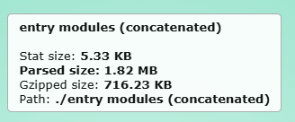
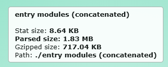
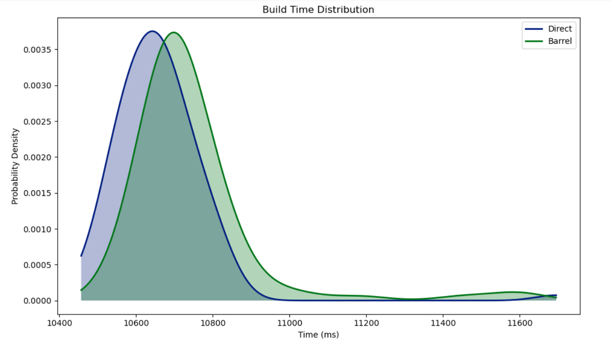
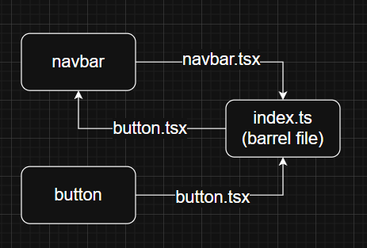
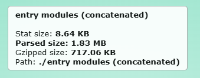
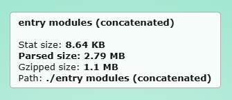

## Understanding Barrel Files in JavaScript/TypeScript

Libraries are used by software engineers as a quick and easy way to add functionality that isn't in the base language. Packages are the compiled versions of these libraries that you download throughout your codebase.

For instance, in a React project, a typical structure is to have a components folder that contains UI elements that occur commonly throughout your pages. This would be your component library. A simple component library might look something like this.  

```ts
/components
  ├── Button.tsx
  ├── Modal.tsx
  └── Card.tsx
```

Which you would import using the following code. Your import path will change depending on how far down the target file is in your folder structure.
```ts
Index.ts
import { Button } from './components/Button';
import { Modal } from './components/Modal';
import { Card } from './components/Card';

```

This isn't an issue with smaller codebases. But when you're importing numerous files, it becomes quite cumbersome to import them all. So, what is the solution? **Barrel Files**

## 🔍 What is a Barrel File?

A **barrel file** is typically an `index.ts` or `index.js` file that re-exports selected exports from other files in the same directory.

For example, instead of writing:
```ts
Index.ts
import { Button } from './components/Button';
import { Modal } from './components/Modal';
import { Card } from './components/Card';

```

You can write:
```ts
Index.ts
import { Button, Modal, Card } from './components';

```

Thanks to a barrel file at `components/index.ts`.  For published libraries, using barrel files is necessary, because requiring the user to know the structure of your codebase to import would remove a great deal of the convenience of installing the package. 

---

## 🛠️ Making a Barrel File

You would modify the file structure, by creating an `index.ts` like so:
```ts
/components
  ├── Button.tsx
  ├── Modal.tsx
  ├── Card.tsx
  └── index.ts // [!code ++]
```

`index.ts` would look like this:
```ts 
Index.ts
export {Button} from './Button';
export {Modal} from './Modal';
export {Card} from './Card';

```

## ⚠️ Costs of barrel files

Barrel files make our lives easier as software developers. So, what's the catch?

An ironclad rule of software engineering is that there is no free lunch. What this means is that this convenience—like so many other things in software engineering—is a tradeoff between developer experience and app performance. 

We're going to examine how the bundle that is passed to your client is affected by the addition of barrel files. 

--- 

## Example Project 

You can find all the code that I used to achieve these results at the github repository here. 

### Increased Bundle Size

I created my own sample application, with 10 dummy files being imported into a barrel file. 
Only one of them is imported and used, but all 10 are exported from the barrel file. 

When we use a bundle analyzer to examine the bundle size, we find that the bundle sent to the server is bigger when using barrel files. This is because the barrel file forces the builder to bundle the 9 dummy files along with the single import. 

#### Comparing Bundle Sizes
Directly Importing results in a parsed bundle size of 1.83 megabytes.


Whereas a barrel import results in a parsed bundle size of 1.82 megabytes



Importing directly improves bundle size as opposed to importing through the barrel file. 

Since the 10 dummy files are just placeholders with 13 lines of code each, the difference in the file sent is only between 0.1-0.2 megabytes. In a proper codebase with full fledged components, this size difference would become much more significant. 

### Increased build time

There is also a cost inherent to reading all the imports of the barrel file and importing them. Of course, this is neglible for only 10 dummy files but when the barrel file gets larger this computational time can add up and slow your work flow. For comparison, I ran each build process 100 times and generated a probability density function for the results.



We can clearly see that the average time is slightly higher. The averages are 10661.32 ms(direct) and 10744.2 ms(barrel) meaning a difference of ~80ms. It's only 8 one hundredths of a second, and is subject to a wide variety of variables because of the operating system. When I ran it, I made sure to close all apps on my computer. But with such a small difference, results will 100% vary if you have other processes running. 

### Circular Imports

Another potential danger of barrel imports is circular importing. This means importing from the barrel file, into one of your components that is being exported out of the barrel file. Say for instance, you have a component called navbar and another called button. 

If you need to import button into navbar, you have to make sure that you're directly importing from the button.tsx file.
Importing button to navbar from the barrel file while exporting navbar to it creates a circular dependency. If there are recursive function calls, this will lead to the entire program crashing due to stack overflow. 

Heres a diagram for clarity: 



A circular import will increase bundle size by a measureable margin. 

## Direct


## Barrel(creating a circular import)


When we directly import the component we want, it only increases bundle size by 0.01 MB. That's only an increase of 0.55% when compared to the original 1.82 value. 

But with a circular import, the package size increases 0.97 MB. That's an increase of 53.3%.

Next.js has actually implemented a way to deal with these issues. In [this article](https://vercel.com/blog/how-we-optimized-package-imports-in-next-js#measuring-performance-improvements) written by Shu Ding, he outlines a feature called `optimizePackageImports` that you can add to your `next.config.js` file. In it, you give an array of library folder names. At build time, the Next.js builder goes in and reads the index file to map your barrel imports to their direct path.


---


## 📌 Should You use Bundles?

Barrel files are a smart and simple way to clean up your imports and keep your project organized. When used thoughtfully, they reduce friction during development and make your codebase easier to navigate. But, they do have tradeoffs that you should be aware of, just like every other tool software engineers use. 

## Benefits of Using Barrel Files

- **Cleaner imports**: Keeps your import statements tidy.
- **Centralized monitoring**: One place to manage module exports.
- **Easier refactoring**: Changing a file path in one place updates everywhere (if your ide supports it).
- **Consistent API exposure**: Ensures your module exports stay consistent and intentional, which is especially useful in design systems or libraries.
- **Reduced cognitive load**: Developers don't need to remember exact file paths for every component.
- **Scales well**: Used in popular icon/component libraries with thousands of exports.


## Costs of Barrel Files

- **Potential Circular dependencies**: If multiple modules import each other via barrels, it unduly increases bundle size.
- **Build slowdown**: Re-exporting everything adds time to code compilation.
- **Increased Bundle Size**: Barrel files causes some bundlers to be unable to tree-shake, so all files are imported.  
